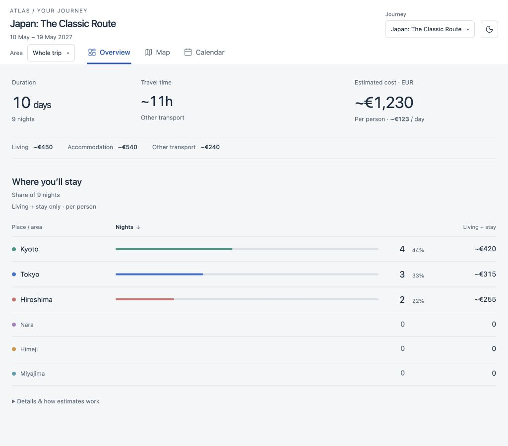
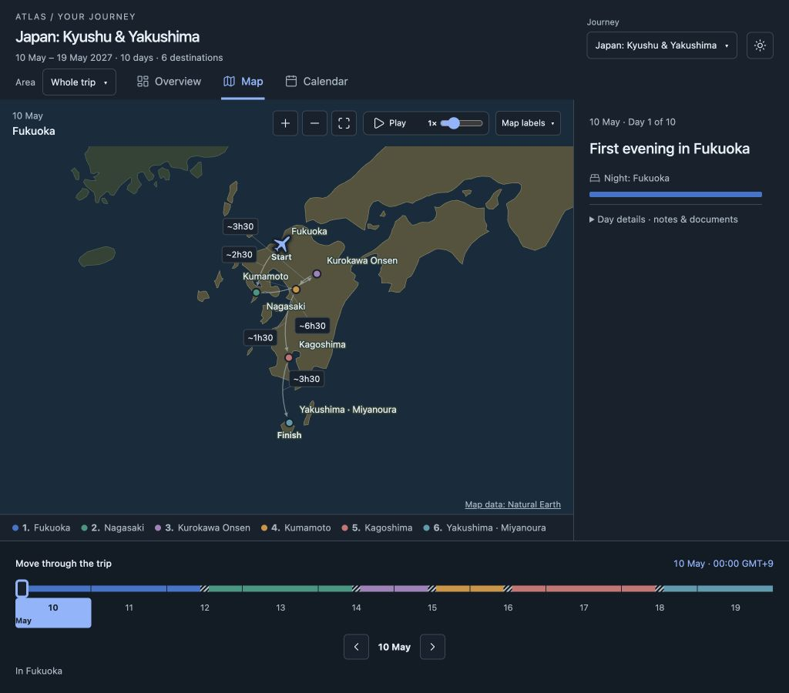

# Trip Atlas

Turn a travel plan into a map, calendar and clear picture of where your time and money go. Open a few JSON itineraries, switch between them, and compare routes, nights, travel time and per-person costs.

Trip Atlas runs locally and reads your files without changing them. No account, database, map API key or runtime internet connection is needed.



## Try it

Install [Node.js 24 or newer](https://nodejs.org/), then run these commands from your cloned repository:

```sh
npm ci
npm start
```

Open [127.0.0.1:4173](http://127.0.0.1:4173). The Journey picker includes seven public demos. Stop the server with Ctrl+C.

## Two ways to spend ten days in Japan

The two featured demos follow **The Classic Route** and **Kyūshū & Yakushima** in _Lonely Planet Japan_, 19th edition (July 2026). Both routes allow ten days in the book; both demo files contain **10 days and 9 nights**.

Open just these alternatives:

```sh
npm start -- trips/japan-classic/trip.json trips/japan-kyushu/trip.json
```

| In these demo files           | The Classic Route                                    | Kyushu & Yakushima                                                     |
| ----------------------------- | ---------------------------------------------------- | ---------------------------------------------------------------------- |
| Route                         | Tokyo → Kyoto → Nara → Himeji → Hiroshima → Miyajima | Fukuoka → Nagasaki → Kurokawa Onsen → Kumamoto → Kagoshima → Yakushima |
| Overnight bases               | 3, with day trips                                    | 6, moving south                                                        |
| Estimated intercity travel    | 10 h 45 min                                          | 17 h 30 min                                                            |
| Illustrative transport cost   | €240                                                 | €275                                                                   |
| Illustrative total per person | €1,230                                               | €1,265                                                                 |

Switch **Journey** in Overview to compare the same ten-day window. The classic route keeps more nights in fewer bases; the southern route changes accommodation more often and allocates more time to transfers. Map shows the route and Calendar shows each day's plan. Nights count the gaps between listed days, so the final day adds no hotel night.

Both use the same illustrative €45 daily living allowance and €60 nightly accommodation share: €450 + €540 before transport. The shared May 10–19, 2027 dates, transport durations, costs and all day notes are original examples, **not book quotations, live fares or bookings**. Travel to Japan and onward travel after the final destination are excluded. See [source pages, adaptations and calculation details](docs/japan-demos.md).



Other demos cover a [sparse undated plan](trips/undated/trip.json), [multiple countries](trips/multicountry/trip.json), [bookings and local documents](trips/bookings/trip.json), [preparation lists](trips/prepare/trip.json), and a [short Japan trip](trips/japan/trip.json).

## Open your own plans

Keep personal files outside this repository and pass one or more paths:

```sh
npm start -- "../my-plans/itinerary.json" "../my-plans/alternative.json"
# After the first build, start faster:
npm run serve -- "../my-plans/itinerary.json"
```

Relative paths use the directory where you invoked npm; quote spaces. Edit the JSON in your editor and refresh the browser. There is no import, upload or save step. Each selected plan can expose only its declared local document links, resolved beside its own JSON file.

A complete minimal itinerary:

```json
{
  "version": 1,
  "title": "A few days in Kyoto",
  "initialPlace": "kyoto",
  "places": {
    "kyoto": {
      "name": "Kyoto",
      "country": "JP",
      "coordinates": { "lat": 35.0116, "lon": 135.7681 }
    }
  },
  "days": [{}, {}, {}]
}
```

Empty days continue the current location. Dates, coordinates, times, costs, bookings and preparation lists are optional; unknown information stays unknown. **Area** filters countries across Overview, Map, Calendar and Bookings; a country becomes an Area once you spend a night there, so home airports and layovers stay on the map without their own Area. Checklist always covers the whole trip, so Area stays locked on it. When a trip visits more than one country, its whole-trip map is a globe: drag to turn it and scroll to zoom. A single country stays a flat map. The map and calendar share a timeline; map lines and untimed animation are schematic.

Booking cards can show meals, check-in/check-out times, baggage allowances, a reminder note and a Google Maps pin for exact coordinates. Trip-wide expenses such as an eSIM are bookings of type `other`, counted once in the whole-trip total. Use the [compact field reference / agent skill](skills/update-itinerary/SKILL.md) to author JSON, and the [format guide](docs/itinerary-format.md) for timezone, cost-replacement and document examples. Trip and manifest JSON are limited to **2 MiB of UTF-8 each**, and numeric totals must remain finite. PDF, raster images, text and JSON documents open inline; other types download. The server is for direct localhost use; see [security and privacy](SECURITY.md).

## Development

```sh
npm run dev    # Vite with public demos
npm run check  # lint, production build, and tests
```

React, TypeScript and D3 render a bundled Natural Earth map. After installing dependencies, builds and the viewer work offline. The map accounts for most of the approximately 2.2 MB JavaScript bundle; no tiles or remote fonts are fetched. Use `npm start` or `npm run serve` to open personal files. `PORT=4180 npm run serve` selects another port on macOS/Linux; in PowerShell, use `$env:PORT=4180; npm run serve`.

[Contributing](CONTRIBUTING.md) · [MIT license](LICENSE) · [Third-party notices](THIRD_PARTY_NOTICES.md)
